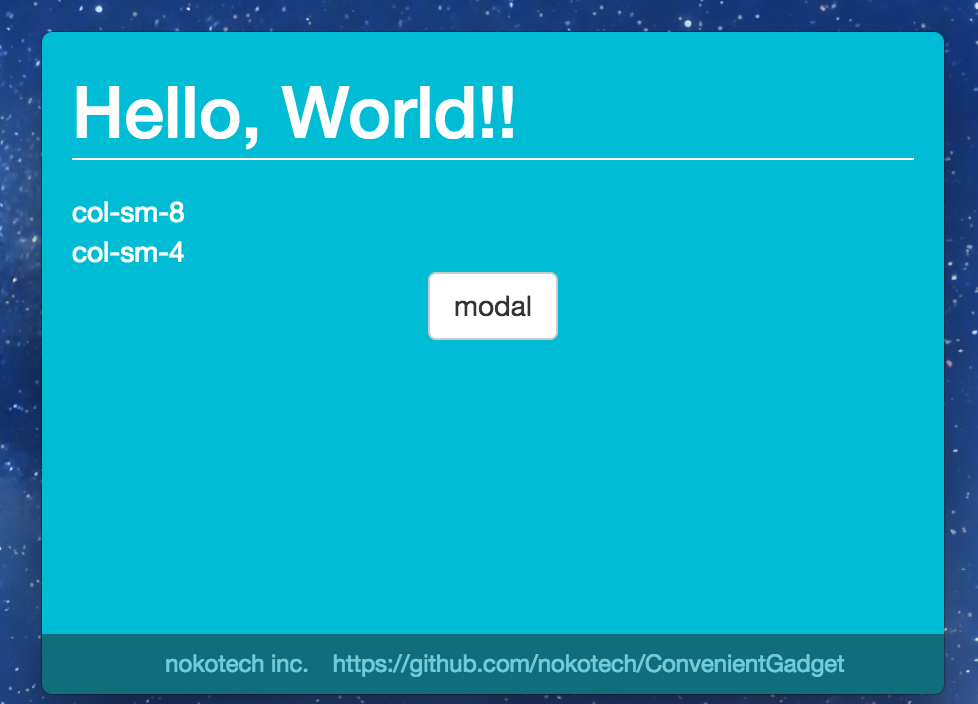

# ConvenientGadget

  

    
    <h3 align="center">ConvenientGadget</h3>
  

## 1. Introduction
This ConvenientGadget is mac and windows gadget.

## 2. Quick Start
### 2.1 install
* global install "electron"  
`npm install electron -g`  
`npm install electron-packager -g`

* install module  
`npm install`

* compile  
`npm start`

### 2.2 output
* mac  
`electron-packager . build/appName --platform=darwin --arch=x64 --overwrite --electron-version=1.4.15`
* windows  
`electron-packager . build/appName --platform=win32 --arch=x64 --overwrite --electron-version=1.4.15`

   
  <a href=""><strong>Takenoko Tech.</strong></a>

